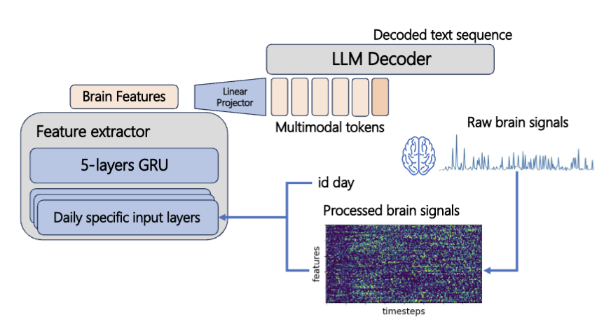
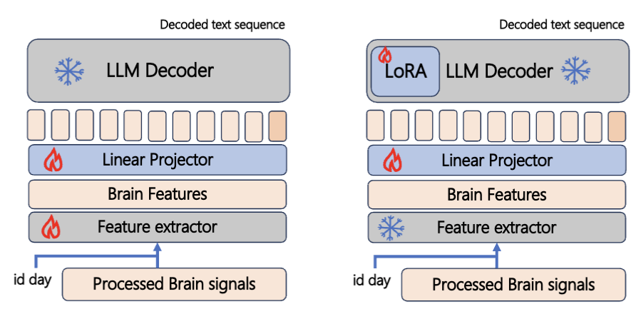
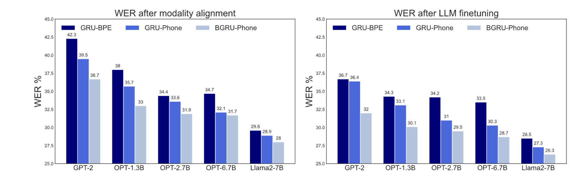

**Towards an End-to-End Framework for Invasive Brain Signal Decoding with Large Language Models (Feng et al., 2024)**

- Train a linear layer to map the features from the GRU-based encoder to the LLM token space
    - Linear layer is applied to the last hidden state before the CTC head

- Training operates in two stages
- First, the GRU and the linear layer are trained while the LLM is frozen
- Next, the LLM is fine-tuned using LORA and the linear layer is trained while the GRU is frozen
- The loss function is the negative log-likelihood conditioned on the previous outputs
- Used GPT2, OPT, and Llama 2 7B for the LLM. Since GPT2 is only 117 M parameters, LORA is not used

- When using byte-pair encoding (BPE) labels for the GRU, performance is very low
- Performance is best with Llama 2 7B, suggesting that LLM quality is an important factor 
- Gains in performance from fine-tuning the LLM are marginal

- This study uses a linear mapping from the feature extractor to the LLM embedding space, whereas SLAM-ASR incorporates a non-linear mapping
- All decoding is done in a non-streaming fashion 