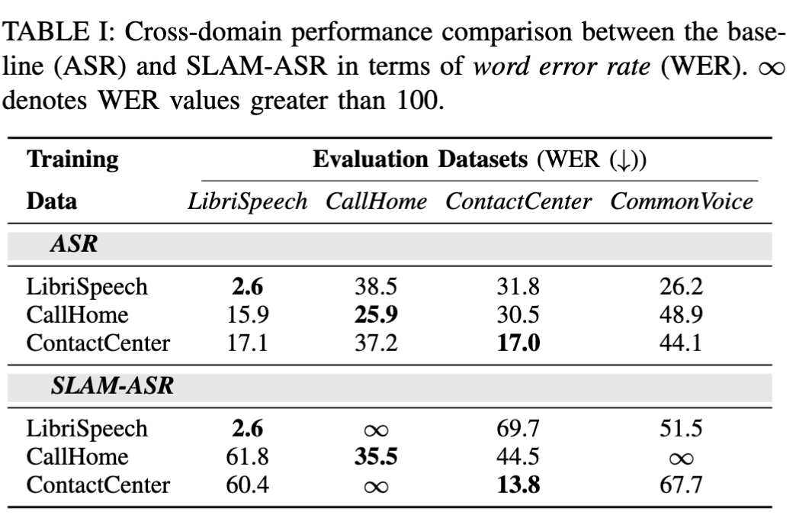
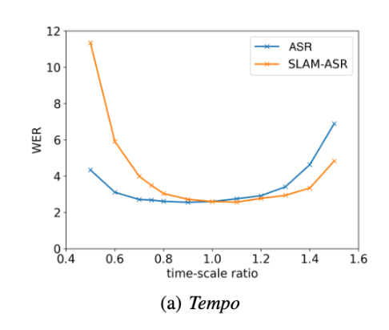

**An Embarrassingly Simple Approach for LLM with Strong ASR Capacity**

- Generate speech embeddings with a variety of models: Whisper, Hubert, Wav2Vec
- Speech embeddings are concatenated every $k$ frames to perform $k$ times down sampling
- Down sampled speech embeddings are then processed by a linear layer → ReLU → linear layer. 
- Best results were obtained when using HuBERT X-Large, fine-tuned on LibriSpeech, with Vicuna 7B
- Allowing the speech encoder to be trained degrades WER by 3-fold

**Performance Evaluation of SLAM-ASR: The Good, the Bad, the Ugly, and the Way Forward**

- SLAM-ASR performs poorly when evaluated on ASR datasets it was not trained on relative to a baseline ASR model
    - The baseline ASR model is a WavLM fine-tuned with CTC
- Poor cross dataset generalization can be attributed to a high number of insertion errors due to LLM hallucinations
- Performed tempo perturbation, which 

- Slowing down the speech tempo hurts SLAM-ASR performance
    - Likely occurs because there is a larger mismatch between the number of frames and the length of the tokenized transcript
- Other types of augmentations (babble noise and music noise) also impact WER more significantly for SLAM-ASR relative to the baseline ASR model

- Fine-tuning the LLM with LORA helps align the speech and text representations

